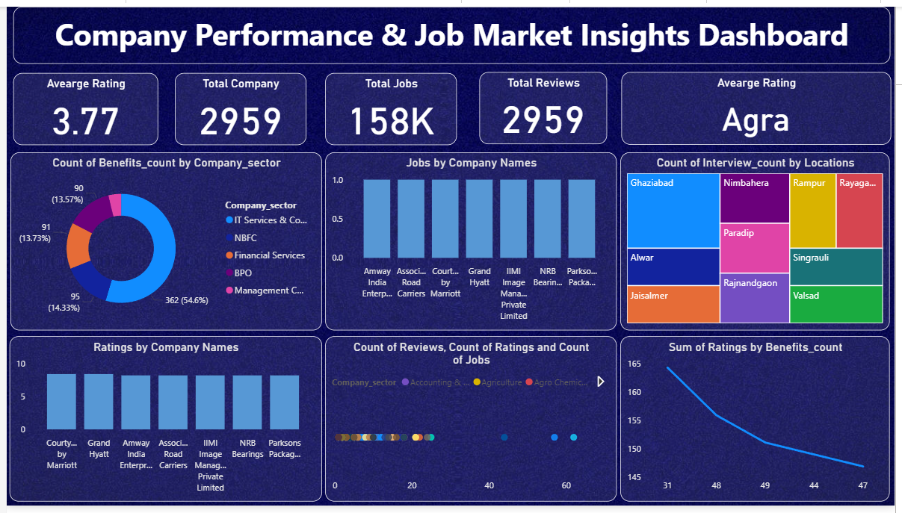

# 📊End-to-End Job Market Analysis using Web Scraping, EDA & AmbitionBox Data 

> 🚀 Transforming 2,900+ real-world job listings into actionable insights using Web Scraping, EDA, and Power BI  

---

## 📊 Dashboard Preview  

---

## 🌟 Overview  
This project presents an **end-to-end Job Market Intelligence solution** built by scraping 2,900+ real-time job listings from AmbitionBox and transforming raw data into meaningful insights.

The project combines **web scraping, exploratory data analysis (EDA), and Power BI visualization** to uncover hiring trends, skill demand, company behavior, and location-based job patterns in the Indian job market.

---

## 🎯 Business Objective  
To analyze real-world job data and uncover key insights such as:

- Which skills are most in demand  
- Which companies are hiring the most  
- Which cities offer the highest job opportunities  
- How demand varies across roles and experience levels  

---

## 🧠 Analytical Approach  

- 🔍 Web scraping to collect real-time job data  
- 🧹 Data cleaning and transformation for accuracy  
- 📊 Exploratory Data Analysis (EDA) to uncover patterns  
- 📈 Power BI dashboard for interactive insights  
- 🎯 Identification of hiring and skill trends  

---

## 🔍 Key Insights  

- 📊 Python, SQL, and Power BI are among the most demanded skills  
- 📍 Major hiring hubs include Bangalore, Delhi, and Mumbai  
- 🏢 A few companies contribute a large share of job postings  
- 📈 Entry-level roles dominate the job market  
- 💼 Skill demand varies significantly across different roles  

---

## 🛠️ Tools & Technologies  

- **Python** (Pandas, NumPy, Matplotlib, Seaborn)  
- **Web Scraping** (BeautifulSoup, Requests)  
- **Power BI** (Dashboard & Visualization)  
- **Excel** (Data Cleaning & Preparation)  

---

## 📂 Project Structure  

Job-Market-Analysis-using-Web-Scraping-EDA/
│
├── Assets/
│   └── dashboard_preview.png
│
├── Dashboard/
│   └── Ambition Box Analysis Dashboard.pbix
│
├── Dataset/
│   ├── Ambitionbox Uncleaned Dataset.csv
│   └── Excel_Cleaned_ambition.xlsx
│
├── Notebooks/
│   ├── Ambitionbox Web Scraping.ipynb
│   └── Ambitionbox Indian Job Market EDA.ipynb
│
└── README.md
## 💼 Business Impact  

- 📊 Helps job seekers understand **market demand & required skills**  
- 🧠 Enables **data-driven career planning**  
- 🏢 Provides insights into **company hiring trends**  
- 📈 Highlights **job distribution and opportunity areas**  

---

## 🚀 Why This Project Stands Out  

✔ Uses **real-world scraped data (2,900+ records)**  
✔ Demonstrates **end-to-end analytics pipeline**  
✔ Combines **data collection + analysis + visualization**  
✔ Focuses on **insights, not just code**  
✔ Structured like a **professional analytics case study**  

---

## 👤 Author  

**Hemant Singh Chauhan**  
📊 Data Analyst  
🔗 [https://www.linkedin.com/in/gauri/](https://www.linkedin.com/in/hemantsinghchauhan/)  
📧 iamhemantsinghchauhan@gmail.com 

---
